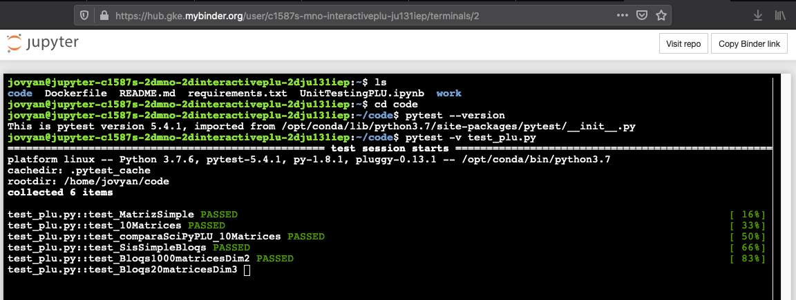

## Unit Testing

Los archivos contenidos en esta carpeta permiten hacer unit testing de forma autocontenida. 

- Se incluyen los modulos para la realización de unit testing utilizando la librería `pytest`:

  - `test_plu.py`
  - `revision_functions.py`
  - `test_plu.py`
  
El proceso de unit testing, para poder ejecutar los test de forma interactiva y en un entorno **aislado** se utilizó `binder` y la imagen de docker disponible en la [carpeta](https://github.com/mno-2020-gh-classroom/ex-modulo-3-comp-matricial-plu-paola-md/tree/master/docker) de este repositorio.  

- Los test unitarios incluidos son:
  - `test_MatrizSimple`: Evalúa la factorización PLU simple para la matriz simple A.
  - `test_10Matrices`: Evalúa la factorización PLU simple para 10 matrices cuadradas aleatorias con dimensión entre (2x2) y (10^3)x(10^3).
  - `test_comparaSciPyPLU_10Matrices`: Evalúa la factorización PLU para 10 matrices cuadradas aleatorias con
    dimensión entre 2x2 y (10^3)x(10^3) y compara los elementos P, L, y U de la factorización asociada obtenidos con
    la librería SciPy
  - `test_SisSimpleBloqs`: Evalúa el algoritmo PLU por bloques para un sistema simple creado de forma determnista.
  - `test_Bloqs1000matricesDim2`: Evalúa 1000 veces el algoritmo de factorización PLU y por bloques para
    matrices aleatorias de hasta de dimensión (10^2 x 10^2)
  - `test_Bloqs20matricesDim3`: Evalúa 20 veces el algoritmo de factorización PLU y por bloques para matrices aleatorias de hasta de dimensión (10^3 x 10^3)
  
**Nota**: Todos los test unitairos fueron aprobados por el algoritmo generado. Para mayores detalles de los mismos, por favor consultar el modulo _test_plu.py_

### Instrucciones para ejecución en `Binder`

En su versión tradicional binder requiere que la ejecución sea realizada enlazando un repositorio público. Razón por la cual se generó [este repositorio](https://github.com/C1587S/MNO-interactivePLU) con los modulos y funcones principales del algoritmo PLU generado. 

Las instrucciones para ejecutar los test unitarios se detallan a continuación:

1. Dar click en el siguiente botón: 
2. Para ejecutar los test unitarios que garantizan vairas pruebas individuales del correcto funcionamiento del algoritmo, debemos **abrir una nueva terminal** en el entorno de jupyter generador por `binder`.

3. Posteriormente, entramos al directorio _code_ y ejecutamos los test unitarios dispnibles en el script _test_plu.py_ utilizando `pytest`.

>$cd code

4. Los comando específicos a ejectuar en la terminal para utilizar `pytest` son los siguientes:

4.1 Si NO queremos que se muestren los stadout intermedios generados durante las pruebas, pero si queremos ver espcíficamente que test fue superado o no, ejecutamos:
  
>$pytest -v test_plu.py

4.2. Si queremos que se muestren los stadout intermedios generados durante las pruebas
  

>$pytest -v -s test_plu.py

**A modo de ejemplo, se presenta una captura de pantalla durante la ejecución de `$pytest -v test_plu.py`:**

